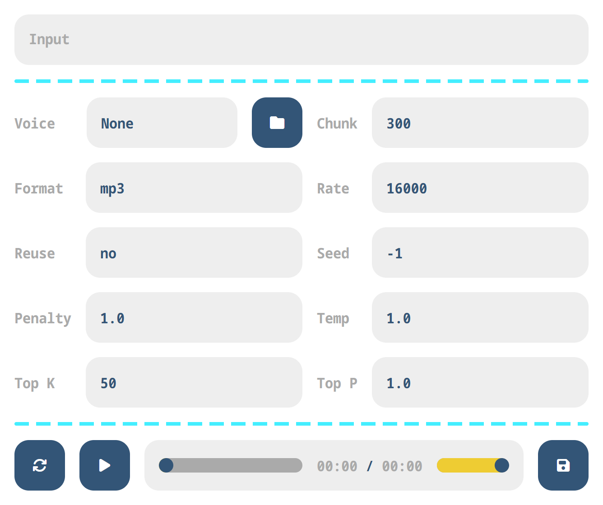

# LLaSA WebUI
A simple WebUI for [LLaSA](https://huggingface.co/collections/HKUSTAudio/llasa-679b87dbd06ac556cc0e0f44) using [ExLlamaV2](https://github.com/turboderp-org/exllamav2) with an [OpenAI](https://platform.openai.com/docs/guides/text-to-speech) compatible [FastAPI](https://github.com/fastapi/fastapi) server.

## Installation
Clone the repo:
```sh
git clone https://github.com/zuellni/llasa-webui & cd llasa-webui
```

Create a venv or conda/mamba env:
```sh
conda create -n llasa-webui python=3.12
conda activate llasa-webui
```

Install dependencies, ignore any `xcodec2` errors:
```sh
pip install "torch==2.6.0" torchao torchaudio torchvision --index-url https://download.pytorch.org/whl/cu126
pip install -r requirements.txt
pip install xcodec2 --no-deps
```

Install `exllamav2` and (optionally) `flash-attn`:
```sh
pip install exllamav2
pip install flash-attn
```

You will likely need wheels for them on Windows. I built these with `python=3.12` and `torch=2.6.0+cu126` and they *should* "just work" if you're following this guide:
```sh
pip install https://huggingface.co/annuvin/wheels/resolve/main/exllamav2-0.2.8-cp312-cp312-win_amd64.whl?download=true
pip install https://huggingface.co/annuvin/wheels/resolve/main/flash_attn-2.7.4.post1-cp312-cp312-win_amd64.whl?download=true
```
Naturally, you shouldn't trust random wheels on the internet so feel free to compile them yourself.

## Models
LLaSA-1B:
```sh
git clone https://huggingface.co/hkustaudio/llasa-1b             model # bf16
```

LLaSA-3B:
```sh
git clone https://huggingface.co/annuvin/llasa-3b-8.0bpw-h8-exl2 model # 8bpw
git clone https://huggingface.co/hkustaudio/llasa-3b             model # bf16
```

LLaSA-8B:
```sh
git clone https://huggingface.co/annuvin/llasa-8b-4.0bpw-exl2    model # 4bpw
git clone https://huggingface.co/annuvin/llasa-8b-6.0bpw-exl2    model # 6bpw
git clone https://huggingface.co/annuvin/llasa-8b-8.0bpw-h8-exl2 model # 8bpw
git clone https://huggingface.co/hkustaudio/llasa-8b             model # bf16
```

X-Codec-2:
```sh
git clone https://huggingface.co/annuvin/xcodec2-bf16            codec # bf16
git clone https://huggingface.co/annuvin/xcodec2-fp32            codec # fp32
```

## Usage
```sh
python server.py -m model -c codec -v voices
```
Add `--cache q4 --dtype bf16` for less [VRAM usage](https://www.canirunthisllm.net). You can specify a HuggingFace repo id for the codec, but you will still need to manually clone one of the LLaSA models above.

## Preview

